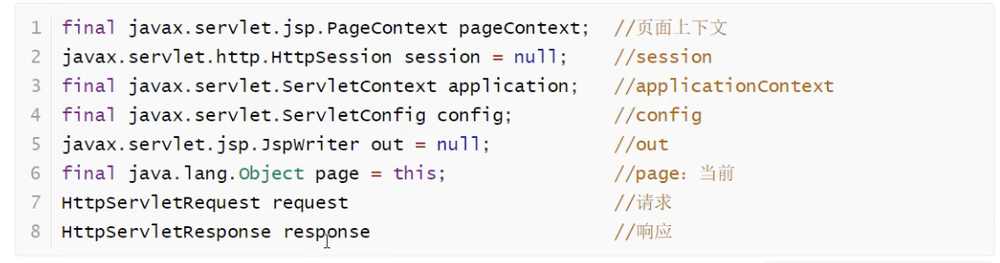
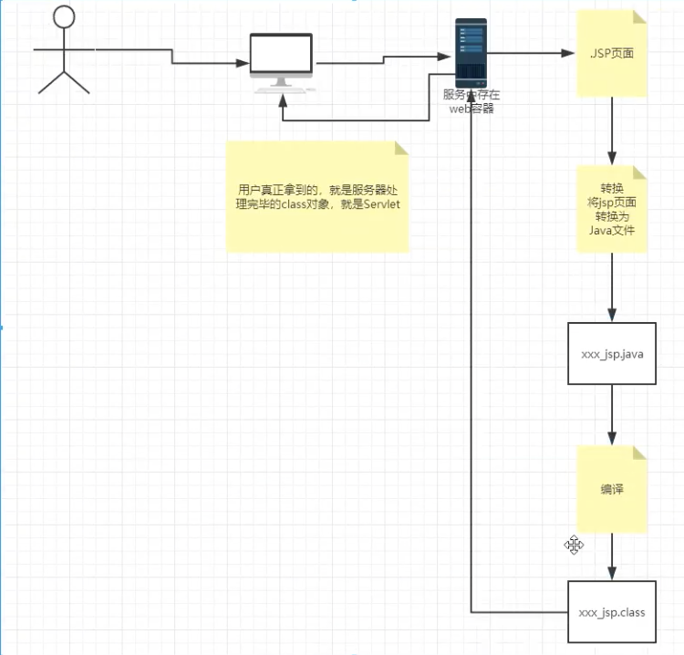
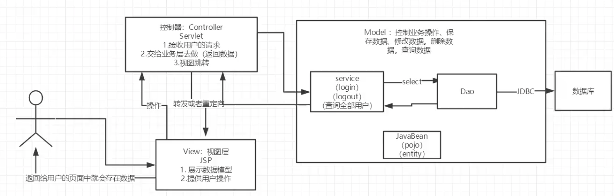
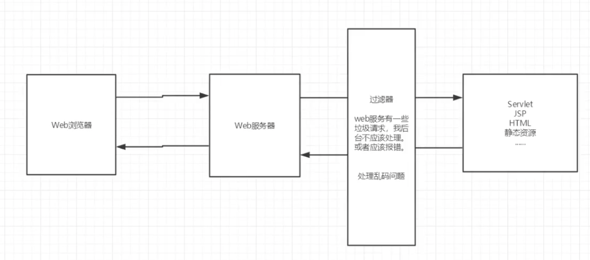
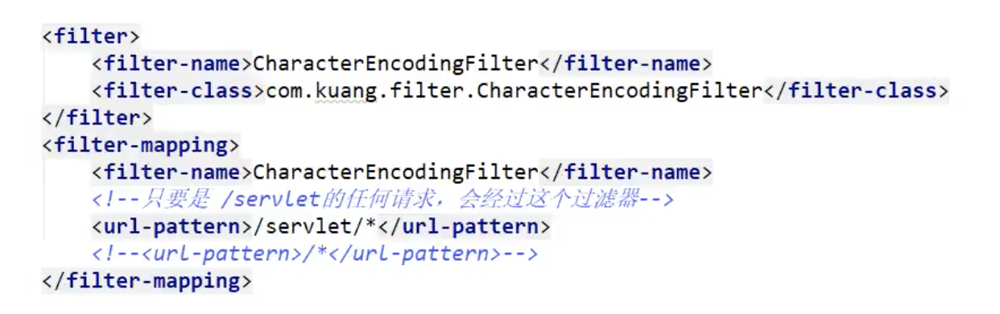
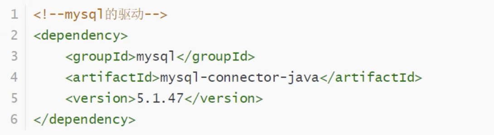
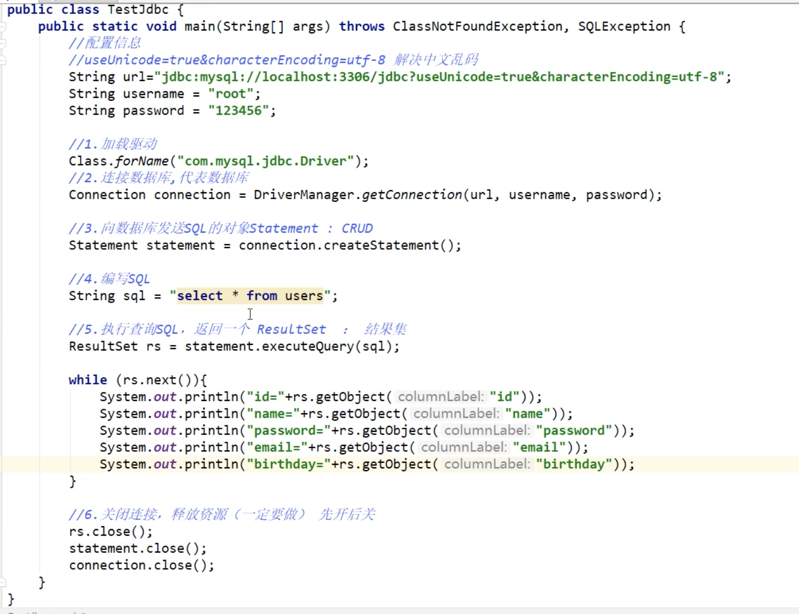

# JavaWeb

如何用git上传到仓库。

[MAC上Git安装与GitHub基本使用](https://www.jianshu.com/p/7edb6b838a2e)

git常用命令

[常用 Git 命令清单](https://www.ruanyifeng.com/blog/2015/12/git-cheat-sheet.html)

狂神的教程。

tomcat在library中。

tomcat启动和关闭见下面的链接：

[https://blog.csdn.net/feng2qing/article/details/60968548](https://blog.csdn.net/feng2qing/article/details/60968548)

# 1、JavaWeb基本概念

静态web和动态web的特点

# 2、Web服务器

## 2.1 技术讲解

ASP

微软，是国内最早流行的。

在html中嵌入了VB脚本，ASP+COM。

每个页面都有业务代码，维护成本高，页面很乱。

PHP

开发速度快，跨平台。

无法承载大访问量。

JSP&Servlet

B&S 浏览和服务器

C&C 客户端和服务器

sun公司主推的B&S架构

基于java语言写的

可以承担三高带来的问题：高并发、高可用、高性能

语法跟ASP很像

## 2.2 web服务器

工作一段时间后，可以手写tomcat服务器。

# 3、Tomcat讲解

## 3.1 安装

在资源库的bin的startup双击。

启动tomcat

[Mac Tomcat安装与启动_哥白尼--CSDN博客](https://blog.csdn.net/weixin_45039471/article/details/104392827)

1、进入Tomcat的bin目录下：终端输入cd /Library/Tomcat/bin ，输完回车

> cd /Library/Tomcat/bin

也可以打开Tomcat文件夹，把bin文件夹直接拖拉到终端，当然前提是先输入cd+空格

2、授权bin目录下的所有操作：终端输入sudo chmod 755 *.sh，输完回车

> sudo chmod 755 *.sh

3、这时要输入密码，输完回车

4、这时候就可以开启Tomcat了，终端输入sudo sh ./startup.sh，输完回车

> sudo sh ./startup.sh

## 3.2 会遇到的问题

## 3.3 配置

tomcat—conf文件

可以配置启动端口号。

默认端口号：8080

mysql：3306

http：80

https：443

```java
<Connector port="8080" protocol="HTTP/1.1"
               connectionTimeout="20000"
               redirectPort="8443" />
```

可以配置主机名称

默认主机名：localhost

默认网站应用存放位置：webapps

```java
<Host name="localhost"  appBase="webapps"
            unpackWARs="true" autoDeploy="true">
```

面试题：谈谈网站是如何访问的。

1、输入一个域名；

2、检查本机的host文件下有没有该域名的配置；

3、如果有，直接返回对应的ip地址，这个地址中有我们需要的web程序，可以直接访问；

4、如果没有，去DNS服务器（全世界的域名都在哪里管理，一个ip对应一个地址），找不到就返回找不到。

5、可以配置环境变量。

## 3.4发布一个web网站

将来自己做的网站放入tomcat的webapps文件夹中，就可以访问了。

# 4、Http讲解

## 4.1 http是什么

http：超文本传输协议，是一个简单的请求-响应协议，它通常运行在TCP之上。

文本：html

超文本：图片，音乐，视频，定位，地图

默认端口是80

https：安全的 443

## 4.2 两个时代

http1.0

客户端与web服务器连接后，只能获得一个web资源，断开连接。

http2.0

客户端与web服务器连接后，可以获得多个web资源。

## 4.3 http请求

客户端—-发请求—-服务器

```java
Request URL: https://www.baidu.com/  //请求地址
Request Method: GET  //get和post方法
Status Code: 200 OK  //状态码200 3 4 5
Remote Address: 119.63.197.151:443  //远程地址
```

```java
Accept: text/html
Accept-Encoding: gzip, deflate, br
Accept-Language: ja,zh-CN;q=0.9,zh;q=0.8,en-US;q=0.7,en;q=0.6
Cache-Control: max-age=0
```

1、请求行

请求行中的请求方式：GET

请求方式：GET和POST HEAD DELETE  PUT

GET：请求能够携带的参数比较少，大小有限制，已在浏览器的url显示数据内容，不安全但是高效。

POST：请求能够携带的参数没有限制，大小没有限制，安全但是不高效。

2、消息头

```java
Accept: 告诉浏览器它所支持的数据类型
Accept-Encoding: 支持的编码格式 GBK UTF-8 GB231 ISO8859-1
Accept-Language: 告诉浏览器它的语言环境
Cache-Control: 缓存控制
Connection: 告诉浏览器请求完成是保持断开还是连接
HOST: 主机
```

## 4.4 http响应

服务器—-响应—-客户端

百度的响应

```java
Cache-Control: private  //缓存控制
Connection: keep-alive  //连接
Content-Encoding: gzip  //编码
Content-Type: text/html  //类型
```

1、响应体

```java
Accept: 告诉浏览器它所支持的数据类型
Accept-Encoding: 支持的编码格式 GBK UTF-8 GB231 ISO8859-1
Accept-Language: 告诉浏览器它的语言环境
Cache-Control: 缓存控制
Connection: 告诉浏览器请求完成是保持断开还是连接
HOST: 主机
Refresh：告诉客户端多久刷新一次
Location：让网页重新定位
```

2、响应状态码

200: 请求响应成功 200

3xx：请求重定向

重定向：重新到新位置

4xx: 找不到资源 404

资源不存在

5xx：服务器代码错误 500

502 网关错误

常见面试题：

在浏览器地址栏输入地址并回车的一瞬间到页面展示出来，发生了什么？

# 5、Maven

自动导入和配置jar包，于是maven产生了，他是个工具，架构管理工具。

## 5.1 Maven项目架构管理工具

方便导入jar包

Maven核心思想：约定大于配置

有约束，不要去违反。

Maven会规定好如何编写java代码。

## 5.2 下载安装

## 5.3 配置环境变量

## 5.4 本地仓库

## 5.5 在idea中使用maven

在maven-repo文件夹中出现了东西。

idea会使用默认的maven，但是要自己配置比较好。

## 5.6 在idea中生成普通maven项目

虚拟路径映射

## 5.7 pom.xml文件

是maven的核心文件。

## 5.8 idea操作

生成目录树


maven仓库：直接搜索。

# 6、Servlet

pom.xml配置文件

[pom.xml、web.xml、springmvc.xml配置文件分别都配置什么？（通俗易懂）_你好像很好吃a的博客-CSDN博客](https://blog.csdn.net/weixin_44296929/article/details/102553478)

## 6.1 servlet简介

servlet在sun公司有两个默认的实现类，一个是HttpServlet，一个是GenericServlet。

一门用来开发动态web的技术。

sun在这些api中提供了一个接口，那就是servlet。如果你想开发一个servlet程序，只要完成两个步骤：

1、编写一个类，实现servlet接口。

2、把开发好的java类部署到服务器中。

把实现了servlet接口的java程序叫servlet。

## 6.2 HelloServlet

1、构建一个maven项目，删掉里面的src目录，以后的学习就在里面建立module。这个空的工程就是maven的主工程。

2、关于maven父子工程的理解：

父项目中有modules，子项目中有parent。

父项目中的jar包自项目可以直接使用，自项目有的父项目不可以直接使用（多态类似）。

父类

```java
<modules>
        <module>servlet-01</module>
    </modules>
```

子

```java
<parent>
    <artifactId>javaweb-02-servlet</artifactId>
    <groupId>com.kuang</groupId>
    <version>1.0-SNAPSHOT</version>
  </parent>

//son extends parent
```

3、maven环境优化

1.修改web.xml为最新的

2.将maven的结构搭建完整

4、编写一个servlet程序

1.编写一个普通类

2.实现servlet接口，直接继承http.servlet

```java
public class HelloServlet extends HttpServlet {

    //由于get和post只是请求实现的不同方式，可以相互调用。

    @Override
    protected void doGet(HttpServletRequest req, HttpServletResponse resp) throws ServletException, IOException {
        //ServletOutputStream outputStream= resp.getOutputStream();
        PrintWriter writer=resp.getWriter(); //响应流
        writer.print("Hello,Servlet");

    }

    @Override
    protected void doPost(HttpServletRequest req, HttpServletResponse resp) throws ServletException, IOException {
        doGet(req, resp);
    }
}
```

5、编写servlet的映射。

我们写的是java程序，但是要通过浏览器访问，而浏览器需要连接web服务器，所以需要在web服务中注册我们写的servlet，还需要给浏览器一个能够访问的路径。

```html
<!-- 注册servlet-->
    <servlet>
        <servlet-name>hello</servlet-name>
        <servlet-class>com.kuang.HelloServlet</servlet-class>
    </servlet>
    <!-- servlet的请求路径-->
    <servlet-mapping>
        <servlet-name>hello</servlet-name>
        <url-pattern>/hello</url-pattern>
    </servlet-mapping>
```

6、配置tomcat

右上角点一下，然后设置路径。

7、启动测试

## 6.3 servlet运行原理

## 6.4 Mapping问题

1、一个servlet可以指定一个映射路径

2、一个servlet可以指定多个映射路径

3、一个servlet可以指定通用映射路径

优先级问题：指定了固有的映射路径优先级最高，*其次，如果没有指定那么就走默认处理请求。

## 6.5 ServletContext

意义解释

[ServletContext](https://blog.csdn.net/gavin_john/article/details/51399425)

web容器在启动的时候，他会为每个web程序创建对应的servletcontext对象，它代表了当前的web对象。

1、共享数据：在这个servlet中保存的数据可以在另一个servlet中拿到。

要创建放置类hello，读取类get类，以及配置一下路径。

2、获取初始化参数。

3、请求转发dispatcher（请求转发和重定向的区别）

4、读取资源文件 properties文件：都被打包到了class路径，我们称为类路径。

需要文件流，porperties的知识要扎实

## 6.6 HttpServletResponse对象

web服务器接收到客户端的http请求，针对这个请求，分别创建一个代表请求的HttpServletRequest对象，一个代表响应的HttpServletResponse对象。

如果要获取客户端请求过来的参数，找HttpServletRequest；

如果要给客户端响应信息，找到HttpServletResponse。

### 1、简单分类

负责向浏览器发送数据的方法。

```java
ServletOutputStream getOutputStream() throws IOException;
PrintWriter getWriter() throws IOException;
```

负责向浏览器发送响应头的方法

```java
void setCharacterEncoding(String var1);
void setContentLength(int var1);
void setContentLengthLong(long var1);
void setContentType(String var1);
void addDateHeader(String var1, long var2);
void setHeader(String var1, String var2);
void addHeader(String var1, String var2);
void setIntHeader(String var1, int var2);
void addIntHeader(String var1, int var2);

//一些常量
int SC_OK = 200;
int SC_BAD_REQUEST = 400;
int SC_NOT_FOUND = 404;
int SC_METHOD_NOT_ALLOWED = 405;
int SC_INTERNAL_SERVER_ERROR = 500;
int SC_GATEWAY_TIMEOUT = 504;
```

### 2、常见应用

1、向浏览器输出东西

2、下载文件

1.获取下载文件的路径

2.下载的文件名是什么

3.想办法让浏览器支持下载需要的东西

4.获取下载文件的输入流

5.创建缓冲区

6.获取outputstream对象

7.将fileoutputstream写入缓冲区

8.使用outputstream将缓冲区的数据输出到客户端（5～8IO内容）

下面是例子。

```java
protected void doGet(HttpServletRequest req, HttpServletResponse resp) throws ServletException, IOException {
//        1.获取下载文件的路径
        //String realPath=this.getServletContext().getRealPath("/IMG_22001.jpg");
        String realPath="/Users/qubeier/Documents/javaweb-02-servlet/response/src/main/resources/IMG_22001.jpg";
        System.out.println("下载路径为："+realPath);
        //realpath
        ///Users/qubeier/Documents/javaweb-02-servlet/response/src/main/resources/IMG_22001.jpg
//        2.下载的文件名是什么
        String fileName=realPath.substring(realPath.lastIndexOf("\\")+1);
//        3.想办法让浏览器支持(Content-Disposition)下载需要的东西
        resp.setHeader("Content-Disposition","attachment; filename="+fileName);
//        4.获取下载文件的输入流
        FileInputStream in=new FileInputStream(realPath);
//        5.创建缓冲区
        int len=0;
        byte[] buffer=new byte[1024];
//        6.获取outputstream对象
        ServletOutputStream out = resp.getOutputStream();
//        7.将fileoutputstream写入缓冲区
//        8.使用outputstream将缓冲区的数据输出到客户端（5～8IO内容）
        while(in.read(buffer)>0){
            out.write(buffer,0,len);
        }

        in.close();
        out.close();
    }
```

### 3、验证码功能

验证码怎么来的？

前端实现。

后段实现，java图片类。

### 4、实现重定向

一个web资源收到客户端请求后，他会通知客户端去访问另外一个客户资源：重定向。

常见实现：用户登录（一行代码）

```java
void sendRedirect(String var1) throws IOException;
```

面试题：重定向和转发的区别

相同点：页面跳转

不同点：请求转发的时候url不会变化307，重定向url会变化302。

## 6.7 HttpServletRequest对象

HttpServletRequest代表客户端的请求，用户通过http协议访服务器，http请求中的所有信心会被封装到HttpServletRequest中，通过这个request对象的方法，我们可以获得客户端的所有信息。

### 1、获取前端传递的参数

### 2、重定向

# 7、Cookie、Session

## 7.1 会话

用户打开了浏览器访问了很多超链接，访问了很多web资源，这个过程被称之为会话。

有状态会话：

一个网站如何证明来过。

1. 服务端给客户端一个信件，客户端下次访问带上信件就可以了。cookie
2. 服务端登记你来过了，下次你来的时候再匹配你。session

## 7.2 保存会话的两种途径

cookie（客户端技术）——响应，请求

session（服务器技术）——可以保存用户的会话信息，把信息或者数据放在session中。

比如：网站登录之后，下次不需要登录了。

## 7.3 Cookie

1. 从请求中拿到cookie，服务器响应给客户端。
2. 用了以下几种方法（见demo文件）

```java
Cookie[] cookies=req.getCookies();  //获得cookie
cookie.getName();  //获得cookie中的key
cookie.getValue();  //获得cookie中的value
new Cookie("lastLoginTime",System.currentTimeMillis()+"");  //新建一个cookie
cookie.setMaxAge(24*60*60);  //设置cookie的有效期
resp.addCookie(cookie);  //响应给客户端一个cookie
```

cookie一般会保存在本地文件下。

一个网站是否存在cookie的上限？一个cookie只能保存一个信息；一个web站点可以给浏览器发送多个cookie，每个站点最多20个；cookie大小限制为4kb；浏览器300个cookie上限。

删除cookie：

1. 不设置有限期，关闭浏览器。
2. 设置有效期为0；

编码解码 URLEncoder.encode

## 7.4 Session(重点)

什么是session：

服务器会给每个用户（浏览器）创建一个会话。

一个session独占一个浏览器，只要浏览器没关闭，那么session就没关。

用户登录之后，整个网站他都可以访问（保存用户的信息，保存购物车的信息）。

session和cookie的区别：

cookie是把用户的数据写给用户的浏览器，浏览器保存（可以保存多个）。

session是把用户的数据写到用户独占的session中，服务器保存（保存重要信息，减少呜服务器资源的浪费）。

session对象由服务器创建。

使用场景：保存一个登录用户的信息；购物车信息；在整个网站中经常会使用的数据保存在session中。

会话自动过期：web.xml中使用。

服务区给用户发一个cookie，用户请求的时候携带cookie；但是session的处理方式是，用户会从服务器那里登记后，拿到sessionid，下次访问服务器就知道是哪个人在访问了。

# 8、JSP

## 8.1 什么是JSP

java server page：java服务器端页面，也和servlet一样用于动态页面的开发。

特点：

写jsp就像在写html。

区别：

html只给用户提供静态页面；

jsp中可以嵌入java代码，提供动态页面。

## 8.2 JSP原理

jsp到底是怎么执行的。

代码层面没有任何问题。

服务器内部工作

tomcat又一个work目录，在idea中使用tomcat会在idea的tomcat中生成一个work目录。

浏览器向服务器发送请求，不管访问什么资源，都是在访问servlet。

jsp最后也会被转换成java类。

1、判断请求


2、内置对象



3、输出页面前增加的代码

4、以上的对象都可以在jsp的页面中直接使用。

前后端不分离，难以维护。

jsp是这样的。



在jsp页面中：

如果是java代码就会原封不动地输出；

如果是html代码就会转换为out.write的对象。

## 8.3 JSP基础语法

java的所有语法它都支持，但也有一些扩充语法。

jsp表达式

```java
<%= java语句%>  //用来把程序的输出输出到客户端
```

jsp脚本片段（每个片段组成可一个大的脚本）

```java
<% java片段 %>
```

脚本片段的再现实

jsp声明（编译后方法声明在类的最前面）

```java
<%!   %>
```

EL表达式（用来取值）

注释

```java
<%--  --%>
```

## 8.4 JSP指令

导入包和一些格式声明

```java
<%@ page isErrorPage="true" %>
<%@ page errorEncoding="utf-8" %>
<%@include file="xxxx" %>  //网页头部共同的部分
<jsp: xxx />
```

## 8.5 九大内置对象

[jsp四大作用域和九大内置对象_mike_jun的博客-CSDN博客_jsp四大作用域](https://blog.csdn.net/qq_40587575/article/details/79810019)

> 输入输出对象：out对象、response对象、request对象通信控制对象：pageContext对象、session对象、application对象Servlet对象:page对象、config对象错误处理对象：exception对象

- page范围：只在一个页面保留数据（javax.servlet.jsp.PageContext(抽象类)）
- request范围：只在一个请求中保存数据（javax.servlet.httpServletRequest）
- Session范围：在一次会话中保存数据，仅供单个用户使用(javax.servlet.http.HttpSession)
- Application范围：在整个服务器中保存数据，全部用户共享(javax.servlet.ServletContext)

PageContext 存东西

Request 存东西

Response

Session 存东西

Application （Servlet context） 存东西

Config （Servlet config）

out

page

exception

双亲委派机制

---

---

request：客户向服务端发送请求，产生的数据用户看完就没用了（新闻）。

session：客户向服务端发送请求，产生的数据用户看完还有用（购物车，也可以统计网站在线人数：统计有多少个session）。

application：客户向服务端发送请求，产生的数据一个用户用完了其余用户还可以用（统计网站人数，qq聊天数据）。

## 8.6 JSP标签、JSTL标签、EL表达式

### 1. EL表达式 ${}

获取数据

执行运算

获取web开发常用对象

调用java方法

### 2. JSP标签

### 3. JSTL标签库

JSTL标签库的使用是为了弥补HTML标签的不足。

自定义了许多标签供我们使用，功能和html相同。

[JSP 标准标签库（JSTL）](https://www.runoob.com/jsp/jsp-jstl.html)

核心标签（掌握部分）

要引入：

```java
<%@ taglib prefix="c" uri="http://java.sun.com/jsp/jstl/core" %>
```


格式化标签

SQL标签

XML标签

# 9、JavaBean

实体类

JavaBean有特定的写法：

必须有无参构造器

属性必须私有化

必须有对应的get和set

一般用来和数据库的字段做映射，ORM。

ORM对象关系映射：

表—>类

字段—>属性

行记录—>对象

# 10、MVC三层架构

什么是MVC：Model view Controller 模型视图控制器

## 10.1 早些年


用户直接访问控制层，控制层可以直接操作数据库。

但是程序很臃肿，servlet代码中要负责请求处理、响应、视图跳转、处理jdbc、处理业务代码

处理逻辑代码。

## 10.2 MVC三层结构



Model

业务处理：业务逻辑（service）

数据持久层：CRUD增删改查（Dao）

View

展示数据

提供链接发起servlet请求（a，form，img…）

Controller

接受用户请求：req获得请求参数、session信息

交给业务层处理对应的业务

控制视图跳转

# 11、Filter过滤器

用来过滤网站的数据。

处理中文乱码

登录验证



Filter开发步骤：

1、导包

2、编写过滤器 implements接口

```java
chain.doFilter(request,response);  //让我们的请求继续走，如果不写的话程序就会被拦截
```



3、在web.xml中配置过滤器

# 12、监听器listener

实现一个监听器的接口（现在用的少了）。

# 13、过滤器、监听器常见应用

# 14、JDBC

## 14.1 基础

什么是jdbc？java连接数据库。


需要jar包的支持：

java.sql

javax.sql

mysql-connector-java(...)连接驱动，必须要的

新建数据库；导入数据库依赖；idea中连接数据库；对数据库进行操作。





jdbc的固定套路：

1、加载驱动

2、连接数据库、代表数据库。

3、向数据库发送sql对象statement：CRUD

statement和preparedStatement（安全的）

```java
//受行数的影响，增删改都用executeUpdate
int i=statement.executeUpdate(sql);
```

4、编写sql，根据业务来写。

5、执行sql。

6、关闭连接。

## 14.2 JDBC事务

要么都成功，要么都失败。

ACID原则：保证数据安全。

[ACID与ACID原则_纸上得来终觉浅，绝知此事要躬行-CSDN博客](https://blog.csdn.net/boonya/article/details/52668705)

```java
开启事务
事务提交 commit
事务回滚 rollBack
关闭事务
```