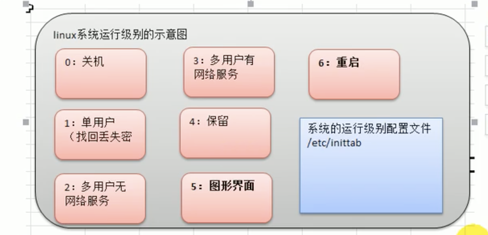
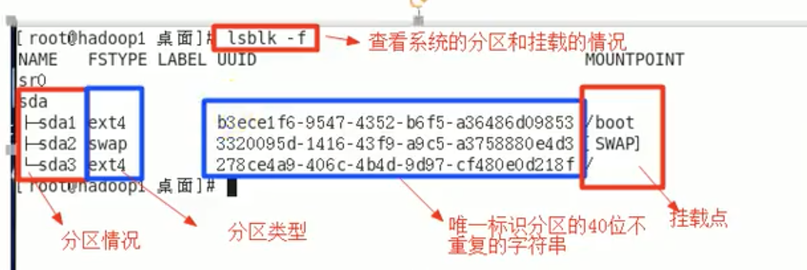

# Linux

一些参考网页

[Linux基础 - Linux Tools Quick Tutorial](https://linuxtools-rst.readthedocs.io/zh_CN/latest/base/index.html)

linux下/etc为系统配置文件目录



# 一、常用指令

## 1、用户管理

```java
ifconfig   //查看虚拟机的ip

shutdown -h now //立马关机
halt     //关机
reboot   //重启系统
sync    //把内存数据写入磁盘

adduser xx   //添加用户
passwd xx    //给xx设置密码
userdel xx    //删除用户xx
cd    //切换目录

id xx    //查询xx用户信息
su - xx    //切换用户名

groupadd xx    //添加组名
groupdel xx    //删除组

useradd -g groupname_xx username_yy    //在xx组中添加用户yy 
usermod -g groupname_xx username_yy    //把用户yy移动到xx组中

```

## 2、实用指令

```java
//1、指定运行级别
/etc/inittab    //查看运行级别（默认是5）
（graphical.target 是runlevel 5）

init 3    //切到3模式
init 5    //切回图形用户界面模式

//2、帮助指令
man
man ls

//查看文件
ls -l(或者直接ll)     //查看文件
ls -la    //查看所有文件 包括隐藏文件)

help cd

//3、文件目录类

pwd    //显示当前工作目录的绝对路径

ls -a    //显示当前目录所有的文件和目录 包括隐藏的
ls -l    //以列表的方式显示所有信息

cd    //切换指令
cd~    //直接回到家目录
cd :    //直接回到家目录
cd..    //回到上级目录
cd /root/    //切换到root目录

mkdir    //创建目录
mkdir /home/dog    //创建dog目录，基本用法
mkdir -p /home/animail/tiger    //一次性创建多级目录，带上-p即可

rmdir   //删除目录
rmdir /home/dog 
//如果目录下有内容，rmdir无法删除
rm -rf /home/dog    //删除非空的目录

touch   //创建空文件
touch tello.txt

cp    //拷贝文件到指定目录
cp -r source dest    //-r递归复制整个文件夹
cp aaa.txt bbb/    //拷贝aaa文件去bbb目录
cp -r test/ zwj/    //将整个test目录拷贝到zwj/下去

rm   //移除文件或目录
-r    //删除整个文件夹
-f    //强制删除不提示
rm -rf bbb/    //强制删除整个/home/bbb目录

mv    //移动或者重命名
mv oldName newName    //改名
mv pig.txt /root/    //移动pig.txt到root下面去
cd /root/

cat    //查看文件内容（只读，不同于vim）
-n    //显示行号
cat -n /etc/rofile/ ｜ more    //加了more是分页操作  more是管道命令

more    //文本过滤器
more xx    //直接查看文件（有些快捷键）

less    //分屏查看内容
less xx    //查看文件
（enter 一行一行走
空格 直接下一页）
//用来查看大型日志

>    //输出重定向（覆盖）
>>    //追加指令（不会覆盖原来的文件，尾部追加）
ls -l > xx    //把ls -l显示的内容加入xx文件中，如果没有这个文件那么就创建一个
cat 文件1 > 文件2    //把文件1的内容覆盖到文件2中去
echo "想写入的内容" > 文件xx    //直接把“”的内容加入文件xx     

echo    //输出内容到控制台
//经常用来输出环境变量
head    //显示文件的开头部分
head -n 5 /etc/profile    ///显示这个文件的前5行
tail    //默认显示后10行
tail -f 文件xx    //实时监控文件xx有没有修改

ln    //软连接指令
history    //查看已经执行过的指令

//4、时间日期类指令
date    //显示当前日期
cal    //显示日历时间

//5、查找指令
find    //查找某文件
find /home -name hello.txt   //查找/home目录下名为hello.txt的文件 -name按名称搜索
find /opt -user nobody    //寻找nobody所拥有的文件 -user
dind / -size +20M    //查找大于20M的文件

locate    //快速定位文件的路径
locate hello.txt    //快速定位hello.txt的路径

grep指令和管道符号｜
//过滤查找，管道符｜表示讲起那一个命令的处理结果输出传递给后面的命令处理
cat hello.txt | grep yes

//6、压缩和解压指令
gzip    //压缩
gunzip    //解压缩
gzip hello.txt    //压缩hello.txt变成了hello.txt.gz
//不会保留原来的文件
gunzip hello.txt.gz    //就回来了

zip/uzip指令（常用）
-d    //制定压缩后问价的存放目录！！很常用
zip -r mypackage.zip /nome/    //对整个home进行压缩 压缩成mypackage.zip

tar    //可以压缩也可以解压，打包指令

```

# 系统相关

## 1、组管理和权限管理

linux组的基本介绍

```java
//查看文件所有者
ls -ahl
//修改文件所有者
chown 用户名 文件名

//查看文件所在组
ls -ahl
//修改文件所在组
chgrp 组名 文件名

//改变用户所在组
usermod 组名 用户名

```

权限的基本介绍（很有用）。

## 2、修改权限（权限管理）

```java
//修改文件权限
chmod    //修改文件权限
chmod u=rwx,g=rx,o=rx abc
chmod 751 abc    //跟上面一个性质，用数字修改权限

//改变文件所有者 chown
chown newowner file    //改变文件所有者
chown newowner:new group file     //改变用户所有者和所有组

//修改文件所在组
chgrp new group file    //改变文件的所有组
```

## 3、crond任务调度

```java
crontab    //进行定时任务的设置

//案例1：每隔一分钟就将当前的日期信息追加到/tmp/mydate文件中。
//现编写一个文件 
/home/mytask1.sh
date >> /tmp/mydate
//给mytask1.sh一个可以执行的权限
chmod 744 /home/mytask1.sh
crontab -e
//这个-e表示定时设置的意思
*/1 * * * * /home/mytask1.sh
//成功
```

## 4、linux的磁盘分区和挂载

```java
mount    //挂载
umount    //卸载

lsblk -f    //查看系统分区和挂载情况

```



如何给虚拟机增加一块硬盘。

## 5、网络配置

```java
ping 目的主机    //测试当前服务器是否可以连接目的主机
```

## 6、进程管理（重点）

对后台的服务进行管理

```java
//查看进程
ps -aux ｜ grep来过滤（或者｜ more来分页）

//终止进程
kill 进程号    //终止某个进程
kill -9 进程号    //强制终止某个进程
killall

//查看进程树
pstree 
-p    //查看进程的pid
-u    //查看进程所属的用户

//服务管理
//服务本质是个进程
service iptables status    //查看防火墙状态
service iptables stop    //关闭防火墙
service iptables start    //打开防火墙
//临时生效，系统重启之后就回复原状。
//希望某个永久生效的话则用chkconfig指令。
//每次打开虚拟机都要重启一次sshd服务才能远程。
ls -l /etc/init.d/    //用列表列出系统有哪些服务

//也可以查看或者修改运行级别
vi /etc/inittab    //查看运行级别
//每个服务对于每个运行级别都有设置是不是自启动状态
chkconfig    //给每个服务的各个运行级别设置自启动和关闭
chkconfig --list|grep xxx
chkconfig --level 5 服务名 on/off    //规定某个运行级别的某个服务的开闭

//动态监控进程
top    //直接出来各种进程的列表
//top和ps很相近，但是top可以自动更新正在运行的进程。
//交互参数
P    //以CPU的使用率排序，默认选项
M    //以呢村的使用率排序
N    //以PID排序
q    //退出top

//监控网络状态
netstat -anp | more    //查看所有的网络服务
-an    //按照一定顺序排列
-p    //显示哪个进程在调用
netstat -anp | grep sshd    //专门肩痛远程控制，可以支持ipv4和ipv6的情况
```

## 7、RPM和YUM包管理

```java
//RPM类似于win.exe，是一种用户互联网下载包和打包的安装工具。
rpm -qa    //查询所有的安装包
rpm -qa | grep firefox    //查询是否有装火狐浏览器
rpm -qi firefox    //查询安装了的rpm包软件的信息
//查询某个文件属于哪个软件包
rpm -qf  /etc/passwd

//rpm卸载和安装
rpm -e 要卸载的包    //卸载要卸载的包

//安装rpm包
rpm -ivh RPM包所在的路径
i install安装
v verbose提示
h hash 进度条
//步骤
//找到firefox的安装包，需要挂载上安装光驱centos的iso文件
//然后到/media/下去找rpm安装包就可以了
//先拷贝过去
//然后直接rpm -ivh 包所在位置

//注
x86_64    //64位系统
i686 i386    //32位系统

 
//YUM是一个shell前段软件包管理器。给予RPM包管理，可以自动处理依赖性软件关系。
//YUM服务器上有很多RPM包
//使用YUM的前提是联网
yum list | grep xxx    //查询是不是YUM里面有xxx软件
yum install firefox    //安装firefox

```

# 二、Shell编程

shell编程快速入门

## 1、shell的变量

```shell
vim myShell.sh    //创建
#!/bin/bash
echo "hello.world"

echo "PATH=$PATH'
echo "user=$USER"
//上面两个是系统变量

chmod 744 myShell.sh  //修改文件权限
./myShell.sh  //执行

A=100
echo "A=$A"
unset A  //撤销这个变量
ceho "A=$A"

//将命令的返回值付给变量
A=`ls -la`  //这是反引号 在键盘1的左边
a=$(ls -la)

//让一些变量称为环境变量，在别的shell里面使用
export >> source >> echo

//位置参数变量
$0 $1
$*
$@
$#

//预定义变量
$$  //当前进程的进程号
$!  //后台运行的最后一个进程的进程号
$?  //最后一次执行的命令的返回状态
```

## 2、运算符的使用

```shell
//用(())
RESULT1=$(((3+2)*4))
echo "result1=$RESULT1"

//用[]
RESULT2=$[(3+2)*4]
echo "result2=$RESULT2"

//用expr
$TEMP=`expr 2 + 3`
RESULT3=`expr $TEMP \* 4`
echo "result3=$RESULT3"
```

## 3、判断语句

```shell
//基本语法
[判断语句]

//常用判断条件
=  //字符串比较
//还有很多
if [ 23 -gt 22]
then
		echo "大于"
fi
//判断23是不是大于22

//判断文件是否存在
if [-e /root/shell/aaa.txt]
then
		echo "exit"
fi

= 字符串比较
-lt 小于
-le 小于等于
-eq 等于
-gt 大于
-ge 大于等于
-ne 不等于
-r 有读的权限
-w 有写的权限
-x 有执行的权限
-f 文件存在并且是一个常规的文件 -e 文件存在
-d 文件存在并是一个目录
```

## 4、流程控制

```shell
//分支控制
//if条件1
if [ 条件判断式 ];then
		程序
fi
//[]中必须有空格

//if条件2
if [ 条件判断式 ] then
		程序
elif [ 条件判断式 ] then
		程序
fi

//case
case $变量名 in
"值1") 
		程序1 ;;
"值2") 
		程序2 ;;
 如果变量的值都不是以上的值，则执行此程序
;; esac

//for循环1
for变量in值1值2值3...
	do
		程序
done

//for循环2
for (( 初始值;循环控制条件;变量变化 ))
	do
		程序
done

//exp1
for j in "$@"
do
		echo "the number is $j"
fi

//exp2
SUM=0
for((i=1;i<=100;i++))
do
		SUM=$[$SUM+$i]
done
echo "SUM=$SUM"

//while循环
while [ 条件判断式 ]
	do
		程序
done

//exp
while [ $i -le $1 ]
do
		SUM=$[$SUM+$i]
		i=$[$i+1]
done
echo "sum=$SUM"
```

## 5、read读取控制台的输入

```shell
read(选项)(参数)

-p  //指定读取值时的提示符
-t  //指定读取值时等待的时间(秒)，如果没有在指定的时间内输入，就不再等待了

//读取控制台输入一个NUM1
read -p "请输入一个数=" NUM1
echo "你输入的值是num1=$NUM1"

//读取，在10s内输入
read -t 10 -p "请输入一个数=" NUM2
echo "你输入的值是num2=$NUM2"
```

## 6、函数和自定义函数

```shell
basename [pathname] [suffix]
basename [string] [suffix] 
//basename命令会删掉所有的前缀包括最后一个(‘/’) 字符，然后将字符串显示出来

//自定义函数
[ function ] funname[()] {
Action; [return int;]
}
调用直接写函数名:funname [值]
```