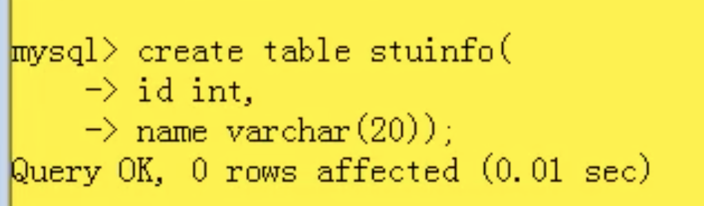

# 1.登陆退出相关

# 1.启动

要启动mysal先打开设置手动打开按钮 然后在cmd中输入：

```java
/usr/local/mysql-5.7.29-macos10.14-x86_64/bin/mysql -u root -p
```

再输入密码即可

要退出的话那么就是

```sql
\q
```

/usr/local/mysql-5.7.29-macos10.14-x86_64/bi

# 2.展示数据库

```sql
show databases;
```

展示数据库

```sql
show databases;
```

打开一个db, table

```sql
use sys;
show tables;
//换一个表显示tables
//但是仍然在之前的库中
show tables from mysql;
//select查看在哪个数据库中 发现在旧的之中
select database();
```

创建一个表



```sql
//显示该table具体的样子
desc stuinfo;
//看具体的数据
select * from stuinfo;
```