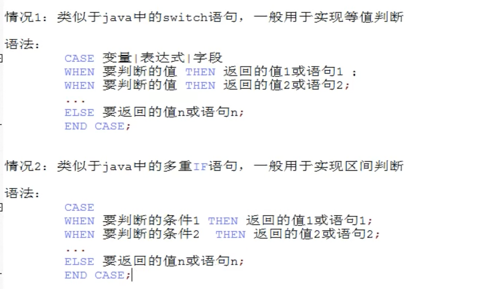
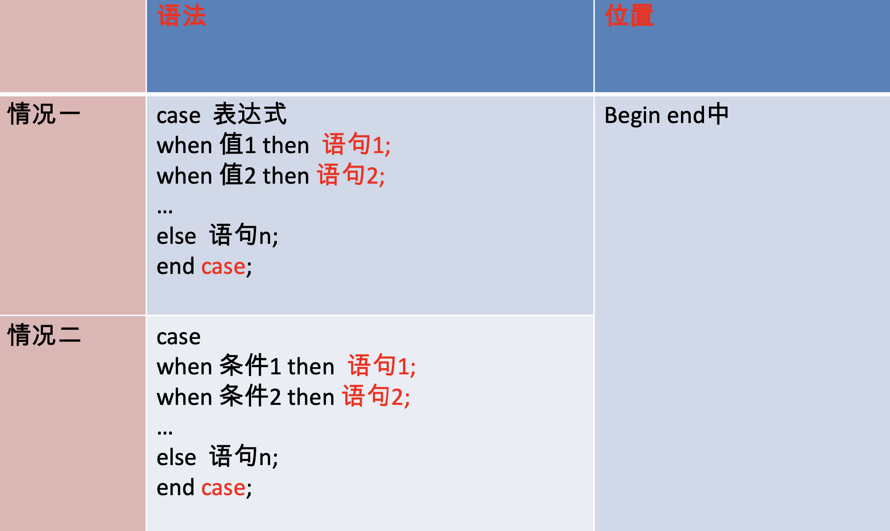

# 10.流程控制结构

```sql
#流程控制结构

/*
顺序结构：程序从上往下依次执行
分支结构：程序可以从两条或多条路径中选一条执行
循环结构：程序在满足一定条件的基础上，重复执行一段代码
*/

#一、分支结构
#1、if函数
/*
功能：实现简单的双分支
语法：
select if(表达式1，表达式2，表达式3)

执行顺序：
如果表达式1成立，则if返回表达式2的值，否则返回表达式3的值。

应用：在任何地方
*/

#2、case结构
/*
情况1:类似于java的switch，等值判断
情况2；java的多重if，实现区间判断

特点：
1、可与座位表达式，嵌套在其他语句中使用，可以放在任何地方，begin end中或者begin end的外面
可以作为独立的语句去使用，只能放在begin end中

2、如果when的值满足或条件成立，则执行对应的then后面的语句，并且结束case
如果都不满足，则执行else中的的语句或值
3、else可以省略，如果else省略了，并且所有的when条件都不满足，那么返回null。
*/

#3、if结构
/*
功能：实现多重分支
语法：
if 条件1 then 语句1;
elseif 条件2 then 语句2;
...
【else 语句n】
end if;

应用：只能在begin end中

*/ 

#二、循环结构
/*
分类：
while、loop、repeat

循环控制（挑转）：
iterate 类似于continue 接触本次训话继续下一次
leave 类似于break 跳出，结束当前所有的循环

*/

#1、while
/*
语法：
【标签：】while 循环条件 do
		循环体;
end while 【标签】;
*/

#2、loop
/*
语法：
【标签：】loop
		循环体;
end loop 【标签】;

可以用来模拟简单的死循环
*/

#3、repeat
/*
语法：
【标签：】repeat
		循环体;
until 结束循环的条件 
end repeat【标签】;
*/

```





循环结构对比


案例

