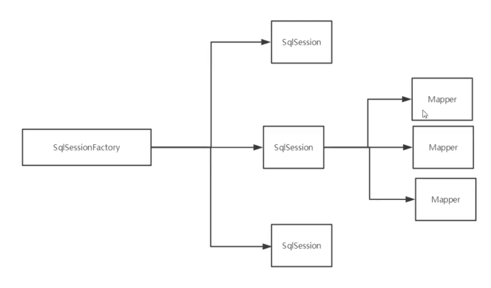

# Mybatis

回顾：

- jdbc（增删改查，事务）
- java基础
- maven
- junit

看官网

SSM框架

## 1、简介

### 1.1 什么是mybatis

- MyBatis 是一款优秀的**持久层框架**（DAO层）
- 它支持自定义 SQL、存储过程以及高级映射
- MyBatis 免除了几乎所有的 JDBC 代码以及设置参数和获取结果集的工作。

如何获得mybatis：

- maven仓库直接搜索，https://mvnrepository.com/artifact/org.mybatis/mybatis/3.5.3
- github仓库地址https://github.com/mybatis/mybatis-3/releases，直接下载文件

### 1.2 什么是持久化

数据持久化

- 持久化就是将程序的数据在持久状态和瞬时而为状态转化的过程
- 内存：**断电即失**
- 数据库jdbc，io文件持久化

为什要持久化

- 有些对象不能丢掉
- 内存太贵了

### 1.3 持久层

Dao层、Servise层，controller层…

- 完成持久化工作的代码块
- 层是界限十分明显

### 1.4 为什么要mybatis

- 方便
- 传统的jdbc代码太复杂了要简化
- 帮助程序员将数据存入数据库
- 不用mybatis也可以，只是更容易上手，技术没有高低之分
- 优点（百度），解除sql与代码的耦合，sql与代码分离

最重要的一点：使用的人多！

## 2、第一个mybatis程序

环境搭建>导入mybatis>编写代码>测试

### 2.1 搭建环境

搭建数据库

### 2.2 编写mybatis工具类

在工具类里面用了官网的套路然后获得了sqlSession

```java
//使用mybatis第一步，获取sqlSessionFactory对象
String resource = "org/mybatis/example/mybatis-config.xml";
InputStream inputStream = Resources.getResourceAsStream(resource);
SqlSessionFactory sqlSessionFactory = new SqlSessionFactoryBuilder().build(inputStream);
//既然有了 SqlSessionFactory，顾名思义，我们可以从中获得 SqlSession 的实例。SqlSession 提供了在数据库执行 SQL 命令所需的所有方法。你可以通过 SqlSession 实例来直接执行已映射的 SQL 语句。
SqlSession session = sqlSessionFactory.openSession()
```

### 2.3编写代码

- 实体类User（就是对应数据库的pojo里的实体类）

- Dao接口 UserDao，UserDaoImpl不需要详细写了

  ```java
  public interface UserDao{
    List<User> getUserList();
  }
  ```

- 接口实现类由原来的UserDaoImpl转换为一个Mapper配置文件

  ```xml
  <!-- namespace绑定一个对应的Dao/Mapper接口-->
  <mapper namespace="com.kuang.dao.UserDao">
    
  <!-- select查询语句-->
    <!-- id绑定userdao的方法， 中间写sql语句，resulttype是返回值类型专注于返回值user-->
  <select id="getUserList" resultType="com.kuang.pojo.User">
          select * from mybatis.user
         </select>
    
  </mapper>
  ```

### 2.4 测试

junit

利用sqlSession来进行操作。

```java
//获取sqlsession对象
SqlSession sqlsession=MybatisUtils.getSqlSession();
//执行sql
//方式一：getMapper
UserDao userdao=sqlSession.getMapper(UserDao.class);
//获得userdao就可以使用各种方法了
List<User> userlist=userDao.getUserList();
for(User user:userList){
  sout(user);
}
  
//关闭sqlsession
sqlSession.close();
```

可能遇到的问题：

1. 配置文件没有注册
2. 绑定接口错误
3. 方法名不对
4. 返回类型不对
5. maven导出资源问题 build

#### 三个核心接口

#### SqlSessionFactoryBuilder

这个类可以被实例化、使用和丢弃，一旦创建了 SqlSessionFactory，就不再需要它了。 因此 SqlSessionFactoryBuilder 实例的最佳作用域是方法作用域（也就是局部方法变量）。 

#### SqlSessionFactory

**SqlSessionFactory 一旦被创建就应该在应用的运行期间一直存在**，没有任何理由丢弃它或重新创建另一个实例。 使用 SqlSessionFactory 的最佳实践是在应用运行期间不要重复创建多次，多次重建 SqlSessionFactory 被视为一种代码“坏习惯”。因此 SqlSessionFactory 的最佳作用域是应用作用域。 有很多方法可以做到，最简单的就是使用**单例模式或者静态单例模式**。

#### SqlSession

每个线程都应该有它自己的 SqlSession 实例。SqlSession 的实例不是线程安全的，因此是不能被共享的，所以它的最佳的作用域是请求或方法作用域。绝对不能将 SqlSession 实例的引用放在一个类的静态域，甚至一个类的实例变量也不行。也绝不能将 SqlSession 实例的引用放在任何类型的托管作用域中，比如 Servlet 框架中的 HttpSession。**每次收到 HTTP 请求，就可以打开一个 SqlSession，返回一个响应后，就关闭它。 这个关闭操作很重要，为了确保每次都能执行关闭操作，你应该把这个关闭操作放到 finally 块中：**

```java
try (SqlSession session = sqlSessionFactory.openSession()) {
  // 你的应用逻辑代码
}catch(Exception e){
}finally{
  sqlsession.close();
}
```

## 3、CRUD

### 3.1 namespace

userMapper.xml配置文件中的

namespace中的包名要和Dao/mapper接口的包名一致。

```java
<mapper namespace="com.kuang.dao.UserMapper">
```

### 3.2 select

选择、查询

- id：就是对应namespace中的方法名

- resulttype：sql一句的返回值！ class

  ```java
  <select id="getUserList" resultType="com.kuang.pojo.User"
  ```

1、编写接口

```java
User getUserById(int id);
```

2、编写对应mapper中的sql语句

```xml
<mapper namespace="com.kuang.dao.UserDao" resultType="com.kuang.pojo.User">
 
<select id="getUserById" parameterType="int">
        select * from mybatis.user where id=#{id}
       </select>
```

3、测试

```java
@Test
public void getUserById(){
  SqlSession session = MybatisUtils.getSqlSession();
  userMapper mapper=sqlSession.getMapper(Usermapper.class);
  User user=mapper.getUserById(1);
  sout(user);
  
  sqlSession.close();
}
```

### 3.3 insert

```xml
insert into mybatis.user (id,name,pwd) values (#{id},#{name},#{pwd});
```

### 3.4 update

```xml
update mybatis.user set name=#{name}, pwd=#{pwd} where id=#{id};
```

### 3.5 delete

```xml
delete from mybatis.user where id=#{id};
```

注意点：

- 增删改查需要提交事务

```java
sqlSession.commit();
```

### 3.6 分析错误

- 标签匹配 insert的标签写成select
- resource绑定mapper必须是斜杠，一开始的xml文件中
- 空指针异常
- maven资源没有导出

### 3.7 万能Map

假设我们的实体类，或者数据库中的表，字段或者参数过多，我们应当考虑使用map。

map传递参数，在sql中取出key即可。

对象传递属性，直接在sql中取出对象的属性即可。

只有一个参数的情况下，可以直接在sql中取。

多个参数用map或者**注解**。

### 3.8 思考题

模糊查询

%李%

1、Java代码执行的时候，传递通配符% %

2、在sql拼接中使用通配符！

## 4、配置解析

### 4.1 核心配置文件

- Mybatis-config.xml

- configuration（配置）
  - [properties（属性）](https://mybatis.org/mybatis-3/zh/configuration.html#properties)
  - [settings（设置）](https://mybatis.org/mybatis-3/zh/configuration.html#settings)
  - [typeAliases（类型别名）](https://mybatis.org/mybatis-3/zh/configuration.html#typeAliases)
  - [typeHandlers（类型处理器）](https://mybatis.org/mybatis-3/zh/configuration.html#typeHandlers)
  - [objectFactory（对象工厂）](https://mybatis.org/mybatis-3/zh/configuration.html#objectFactory)
  - [plugins（插件）](https://mybatis.org/mybatis-3/zh/configuration.html#plugins)
  - environments（环境配置）
    - environment（环境变量）
      - transactionManager（事务管理器）
      - dataSource（数据源）
  - [databaseIdProvider（数据库厂商标识）](https://mybatis.org/mybatis-3/zh/configuration.html#databaseIdProvider)
  - [mappers（映射器）](https://mybatis.org/mybatis-3/zh/configuration.html#mappers)

### 4.2 环境配置（environments）

MyBatis 可以配置成适应多种环境。**尽管可以配置多个环境，但每个 SqlSessionFactory 实例只能选择一种环境。**

```java
<environments default="development">
  //default=id用来选择使用什么样的环境
  <environment id="development">
  //默认事务管理器是jdbc
    <transactionManager type="JDBC">
      <property name="..." value="..."/>
    </transactionManager>
    <dataSource type="POOLED">
  //默认连接池：POOLED，有连接池，让web响应更加快捷。
      <property name="driver" value="${driver}"/>
      <property name="url" value="${url}"/>
      <property name="username" value="${username}"/>
      <property name="password" value="${password}"/>
    </dataSource>
  </environment>
</environments>
```

### 4.3 属性（properties）必须放在第一个，有顺序。

可以通过properties属性来实现引用配置文件。

这些属性可以在外部进行配置，并可以进行动态替换。你既可以在典型的 Java 属性文件中配置这些属性，也可以在 properties 元素的子元素中设置（db.propertise）。

db.propertise就是正常配置，跟原来一样。

在核心配置中引入：

```java
<properties resource="org/mybatis/example/config.properties">
  <property name="username" value="root"/>
  <property name="password" value="123456"/>
</properties>
```

- 可以直接引入外部文件
- 可以在其中增加一些属性配置
- 如果两个文件有同一字段，那么优先使用外部配置

### 4.4 类型别名（typeAliases）

### 4.5 设置（settings）

| **cacheEnabled**   | 全局性地开启或关闭所有映射器配置文件中已配置的任何缓存       |
| ------------------ | :----------------------------------------------------------- |
| lazyLoadingEnabled | 延迟加载的全局开关。当开启时，所有关联对象都会延迟加载。 特定关联关系中可通过设置 `fetchType` 属性来覆盖该项的开关状态。 |
|                    |                                                              |

### 4.6 其他

### 4.7 生命周期和作用域

不然会产生并发问题。

工厂模式


SQLSessionFactoryBuilder：

- 一旦创建了SQLSessionFactory就不再需要他了
- 局部变量

SQLSessionFactory（工厂）：

- 数据库连接池
- 创建后就一直存在，没有理由丢弃或者重建
- 最简单的是**单例模式**或者**静态单例模式**

SQLSession：

- 连接到连接池的一个请求
- 线程不安全，因此不能被共享，最佳作用域是放进方法中
- 用完之后需要关闭



## 5、解决属性名与字段名不一致的问题

解决方法：

- sql里起别名

- 使用resultMap（结果集映射）

  https://mybatis.org/mybatis-3/zh/sqlmap-xml.html#Result_Maps


`resultMap` 元素是 MyBatis 中最重要最强大的元素

ResultMap 的设计思想是，对简单的语句做到零配置，对于复杂一点的语句，只需要描述语句之间的关系就行了。

什么不一样就转什么。

## 6、日志

### 6.1 日志工厂

如果一个数据库操作出现异常，我们需要排错。日志就是最好的助手。

曾经：sout、debug

现在：日志工厂logImpl

- SLF4J
- LOG4J（掌握）
- STDOUT_LOGGING（掌握）

STDOUT_LOGGING是标准日志输出，在setting里面。

### 6.2 LOG4J

Apache的开源项目log4j是一个功能强大的日志组件（框架）,提供方便的日志记录。可以控制每一条日志的输出格式。

1. 先导包maven仓库里面
2. log4j.properties文件编写
3. setting里配置该文件
4. 使用 运行完生成log日志文件

## 7、分页

减少数据的处理量，提高效率。

limit 4, -1 //查所有的值

### 7.1 limit分页

使用mybatis分页：

1. 接口
2. Mapper.xml
3. 测试

正常写就好，可以用hashmap。

### 7.2RowBounds分页（少用）

## 8、使用注解开发

除了mybatis之外都是注解开发，它是注重配置文件。

### 8.1 面向接口编程

**根本原因：解耦、可拓展，提高复用。**


**关于接口的理解**

接口从更深层次的理解，应是定义（规范、约束）和现实（名实分离的原则）的分离。

接口本身反映了系统设计人员对系统的抽象理解。

接口应有两类：

- 对一个个体的抽象：对应为一个抽象体（abstract class）。
- 对一个个体某一方面的抽象，形成一个抽象面（interface）。

一个体可能有多个抽象面，抽象体与抽象面是有区别的。

###  8.2 使用注解开发

sql与java没有分离。

简单的可以使用。

**代理模式**

Mybatis详细执行流程：

### 8.3 CRUD

可以在工具类里面自动提交注解。

关于@Param()注解

#{}和${}：用刀符号不安全


## 9、Lombok

偷懒神器

只需要在类上面加一个注解就可以不用写get和set了。

1. 在idea中安装lombok插件
2. 在项目中导入lombok的jar包
3. 加注解

@Data注解在class上就可以了。

data：无参构造，getset，tostring，hashcode

allargconstructor：有参构造

不支持多种参数构造起的重载，可以手动加入。

## 10、多对一处理

- 多个学生对应一个老师
- 对于学生而言，关联、多个学生**关联**一个老师---多对一。association
- 对于老师而言，**集合**、一个老师有很多学生---一对多。collection

注解只能用class的方式注册，而不是source。

测试环境搭建：

1. 导入lombok
2. 新建实体类Teacher，student
3. 建立mapper接口
4. 建立mapper.xml文件
5. 在核心配置文件绑定注册过的mapper接口或者文件
6. 测试查询是否能够成功

### 10.1 多对一处理

1、按照查询嵌套处理。

2、按照结果嵌套处理（用得多）。

```XML
<?xml version="1.0" encoding="UTF-8" ?><!DOCTYPE mapper        PUBLIC "-//mybatis.org//DTD Config 3.0//EN"        "http://mybatis.org/dtd/mybatis-3-mapper.dtd">
<mapper namespace="com.msdn.dao.StudentMapper">    
  <select id="getStudent2" resultMap="studentMap">        
    select s.id sid,s.name sname,t.id ttid,t.name tname        
    from student s,teacher t        
    where s.tid=t.id;    
  </select>    
  
  <resultMap id="studentMap" type="student">        
    <id property="id" column="sid" />        
    <result property="name" column="sname" />        
    <!--关联对象property 关联对象在Student实体类中的属性-->        <association property="teacher" javaType="Teacher" >            
    <id property="id" column="ttid" />            
    <result property="name" column="tname" />        
    </association>    </resultMap></mapper>
```


回顾多对一查询：子查询和联表查询。


### 10.2 一对多查询

一个老师拥有多个学生

对于老师而言，就是一对多的关系。

很不错的总结。

https://juejin.cn/post/6844904110135705607

因为要获得一堆学生，所以是个list，用collection。

```xml
<?xml version="1.0" encoding="UTF-8" ?>
  <!DOCTYPE mapper        PUBLIC "-//mybatis.org//DTD Config 3.0//EN"        "http://mybatis.org/dtd/mybatis-3-mapper.dtd"><mapper namespace="com.msdn.dao.TeacherMapper">    
  <select id="getTeacherById" resultMap="TeacherStudent">        			select s.id sid,s.name sname,t.id tid,t.name tname        
  	from mybatis.student s,mybatis.teacher t        
  	where s.tid = t.id and t.id =#{id}    
</select>    
  <resultMap id="TeacherStudent" type="Teacher">        
  <id property="id" column="tid" />        
  <result property="name" column="tname" />        
  <collection property="students" ofType="Student" >            <result property="id" column="sid" />            
  <result property="name" column="sname" />            
  <result property="tid" column="tid" />        
  </collection>    
  </resultMap>
  </mapper>
```

## 12、动态SQL

**动态sql：根据不同的SQL生成不同的语句。**

动态 SQL 是 MyBatis 的强大特性之一。如果你使用过 JDBC 或其它类似的框架，你应该能理解根据不同条件拼接 SQL 语句有多痛苦，例如拼接时要确保不能忘记添加必要的空格，还要注意去掉列表最后一个列名的逗号。利用动态 SQL，可以彻底摆脱这种痛苦。

- if
- choose (when, otherwise)
- trim (where, set)
- foreach

### 12.1 If条件句

看文档就行了。

https://mybatis.org/mybatis-3/zh/dynamic-sql.html

### 12.2 常用标签

### 12.3 foreach

## 13、缓存

查询连接数据库，耗费资源。

一次查询的结果暂存到可以直接取到的地方。内存：缓存。

我们在此查询相同数据的时候，直接走缓存，不用走数据库。

### 13.1 什么是缓存

放在内存中的临时数据。

主从复制、读写分离。

https://www.huaweicloud.com/articles/5592819ec493a5b4bc353821bb30bbd5.html

经常查询切不经常改变的数据，可以使用缓存。

### 13.2 mybatis缓存

- mybatis包含一个很强大的查询缓存特性，可以极大提升效率。
- mybatis系统中默认定义了两级缓存：一级缓存和二级缓存。
  - 默认情况下只开启一级缓存（sqlsession级别，也被称为本地缓存）。
  - **二级缓存要手动开启和配置**，基于namespace级别。
  - 定义了缓存接口cache，可以通过实现这个接口配置二级缓存。

### 13.3 一级缓存

sqlsession开启关闭之间就有缓存了。

### 13.4 二级缓存

二级缓存是全局缓存，一级缓存作用域太低了，所以诞生了二级缓存。

基于namespace级别的缓存，一个名称空间，对应一个二级缓存。

工作机制：

- 一个会话查询一条数据，那么就会被存放在一级缓存中。
- 如果当前会话关闭了，这个会话的一级缓存就没了；但我们想要的是把一级缓存保存到二级缓存中。
- 这样的话，新的会话查询内容，就可以从二级缓存中获取。
- 不同的mapper查处的数据会放在自己对应的缓存中。

默认情况下，只启用了本地的会话缓存，它仅仅对一个会话中的数据进行缓存。 要启用全局的二级缓存，只需要在你的 SQL 映射文件中添加一行：

```xml
<cache/>
```

步骤：

1. 开启全局缓存

   ```xml
   <!--显式地开启全局缓存 -->
   <setting name="cacheEnabled" valued="true"/>
   ```

2. 在要使用二级缓存的mapper.xml中配置<cache/>及一些参数。

3. 测试

**尽量将实体类序列化。**

小结：

- 只要开启了二级缓存，在同一个mapper下都有效。
- 所有数据都会被先放到一级缓存中。
- 只有会话关闭才会提交到二级缓存，并且可自定义存储源，如 Ehcache。
- 一级缓存和二级缓存中都没有，那么就查询数据库。

### 13.5 缓存原理

https://www.jianshu.com/p/5ff874fa696f


### 13.6 自定义缓存ehcache

