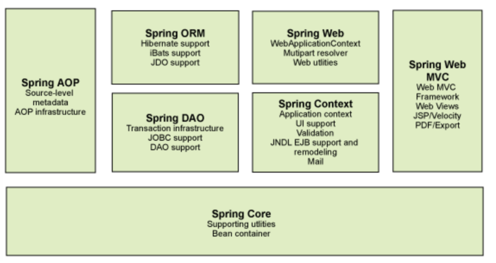
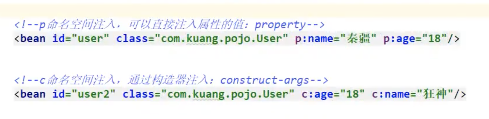
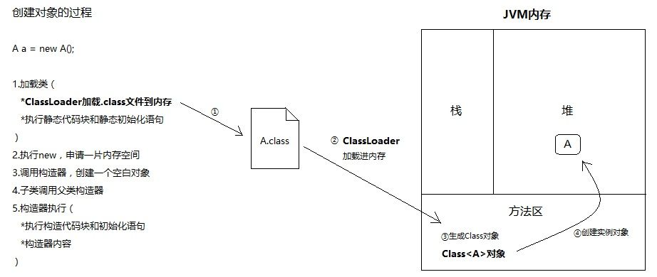
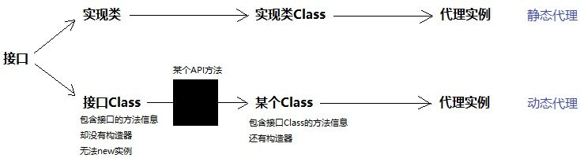

### 1.1 spring简介

- Rod Johnson创始人，是音乐学的博士。
- spring理念：解决企业应用开发的复杂性，本身是个大杂烩，几乎支持所有东西，整合了现有的技术框架。
- SSH：Struct2+spring+hibernate
- SSM：SpringMVC+Spring+Mybatis


官网：https://spring.io/projects/spring-framework

官方下载地址：https://repo.spring.io/ui/native/libs-release-local/org/springframework/spring/

github地址：https://github.com/spring-projects/spring-framework/releases/tag/v5.2.16.RELEASE

maven：

```xml
<!-- https://mvnrepository.com/artifact/org.springframework/spring-webmvc -->
<dependency>
    <groupId>org.springframework</groupId>
    <artifactId>spring-webmvc</artifactId>
    <version>5.3.9</version>
</dependency>

<!-- https://mvnrepository.com/artifact/org.springframework/spring-jdbc -->
<dependency>
    <groupId>org.springframework</groupId>
    <artifactId>spring-jdbc</artifactId>
    <version>5.3.9</version>
</dependency>
```

### 1.2 优点

- 免费开源框架（容器）
- 轻量级、非入侵式的框架（导入之后不会改变原有的代码）
- **控制反转（IOC），面向切面编程（AOP）**
- 支持事务的处理，对框架整合的支持。

总结：spring就是轻量级控制反转和面向切面编程的框架。



springboot：

一个快速开发的脚手架，基于它可以快速开发但各位服务，约定大于配置。

springcloud

基于springboot实现的。


现在大多数公司都在使用springboot进行快速开发，学习springboot的前提是完全掌握spring和springMVC，具有承上启下的作用。

弊端：发展太久违背了原来的理念。现在配置十分繁琐。

## 2、IOC理论推导

1. UserDao接口

2. UserDaoImpl实现类

3. UserService业务接口

   业务层调用Dao层用**组合**的概念，除了**继承**还有组合。

   组合是这个东西：https://blog.csdn.net/zymx14/article/details/79605926

   直接把一个类创建对象放在另一个类中。

4. UserServiceImpl业务实现类（业务层就是专门用来调dao层的）

5. 测试

   测试中，用户实际调用的是业务层，dao层他们不需要接触，但是调用之后输出的是dao层的方法。

如果dao层有不同的类，那么就必须去改源代码，要解决这个问题。

本来是直接调用某个类去建立这个对象，现在是利用set进行动态实现值的注入。


在我们之前的业务中，用户的需求会影响原来的代码，我们需要根据用户的需求去修改源代码，修改代价太高。

用set接口实现，会发生革命性的变化。

- 之前程序是主动创建对象，控制权再程序员手上。
- 使用了set注入后，程序员不再具有主动性，而是变成了被动的接收对象。

**这就是控制反转。**

这种思想从本质上解决了问题，程序员不用再去管理程序的创建。

系统的耦合性大大降低，可以更加专注在实现业务上，这就是IOC的原型！

### IOC本质

https://www.jianshu.com/p/07af9dbbbc4b

DI（依赖注入）是实现IOC的一种方式。

控制反转是一种通过描述（XML或者注解）并通过第三方去生产或者获取特定对象的方式，在spring中实现控制反转的是IoC容器，器实现方法是依赖注入（Dependency Injection，DI）。

## 3、HelloSpring

控制：用了spring之后，对象是由spring创建的。

反转：创建对象的人物变了。

要实现不同的操作，只要在bean中修改就可以了。

1. 创建hello的java类

   ```java
   public class Hello {
       private String str;
   
       public String getStr() {
           return str;
       }
   
       public void setStr(String str) {
           this.str = str;
       }
   
       @Override
       public String toString() {
           return "hello{" +
                   "str='" + str + '\'' +
                   '}';
       }
   }
   ```

2. resources中创建beans.xml

```XML
<?xml version="1.0" encoding="UTF-8"?>
<beans xmlns="http://www.springframework.org/schema/beans"
       xmlns:xsi="http://www.w3.org/2001/XMLSchema-instance"
       xsi:schemaLocation="http://www.springframework.org/schema/beans
        http://www.springframework.org/schema/beans/spring-beans.xsd">

    <!--使用spring来创建对象，在spring中这些都被称为bean
    正常： 类型 变量名=new 类型（）；
    Hello hello=new Hello();

    bean是对象， new了hello（）
    id是变量名 class是要new的对象
    property 相当于给对象中的属性设置一个值，value是spring
    -->
    <bean id="hello" class="kuang.com.pojo.Hello">
        <property name="str" value="Spring"/>
        <!--value或者ref 
				ref是引用spring容器中创建好的值 
				value是一个具体的值、基本数据类型-->
    </bean>

</beans>
```

3. test

```java
public class MyTest {
    public static void  main(String[] args){
        //获取spring的上下文对象
        ApplicationContext context = new ClassPathXmlApplicationContext("beans.xml");
        //我们的对象都在spring中管理了，现在要取出来
       Hello hello = (Hello)context.getBean("hello");
       System.out.printf(hello.toString());
    }
}
```

## 4、IOC创建对象的方式

1. 使用无参构造创建对象（默认方式）

2. 有参构造(3种方式) 构造注入

   1. 下标赋值

      ```XML
      <bean id="user" class="com.kuang.pojo.User">
        <constructor-arg index="0" value="要打印的东西"/>
      </bean>
      ```

   2. 类型赋值（不建议，如果两个参数类型是一致的那就不好用了）

      ```XML
      <bean id="user" class="com.kuang.pojo.User">
        <constructor-arg type="java.lang.String" value="要打印的东西"/>
      </bean>
      ```

   3. 直接通过参数命名

      ```xml
      <bean id="user" class="com.kuang.pojo.user">
        <constructor-arg name="name" value="要打印的东西"/>
      </bean>
      ```

总结：在配置文件夹在的时候，容器中管理的对象就已经初始化了。

## 5、Spring配置说明

### 5.1 别名 Alias

User类的别名可以起别名。

```xml
<alias name="user" alias="userNew"/>
```

### 5.2 Bean的配置

<bean>下面的

**id是new出来的名字，是bean的唯一标识符，也就是对象名。**

**class是bean对象所对应的全限定名。**

**name也是别名，name可以同时取多个别名。**

### 5.3 import

一般用于团队开发使用，可以将多个配置文件导入合并成一个。

applicationContext.xml中导入多个beans文件，那么就合并起来了。

## 6、依赖注入DI

### 6.1 构造器注入

前面说过。

### 6.2 Set方式注入【重点】

- 依赖注入：Set注入！
  - 依赖：bean对象的创建依赖于容器。
  - 注入：bean对象的所有属性，由容器来注入！

【环境搭建】

1. 复杂类型

   ```java
   public class Address {
       private String address;
   
       public String getAddress() {
           return address;
       }
   
       public void setAddress(String address) {
           this.address = address;
       }
   }
   ```

2. 真实测试对象

   ```java
   public class Student {
       //复杂类
       private String name;  //通过value复制
       private Address address;  //通过ref复制
       private String[] books;
       private List<String> hobbies;
       private Map<String,String> card;
       private Set<String> games;
       private String wife;
       private Properties info;
   }
   ```

3. beans.xml

   ```XML
   <?xml version="1.0" encoding="UTF-8"?>
   <beans xmlns="http://www.springframework.org/schema/beans"
          xmlns:xsi="http://www.w3.org/2001/XMLSchema-instance"
         xsi:schemaLocation="http://www.springframework.org/schema/beans
           http://www.springframework.org/schema/beans/spring-beans.xsd">
       <bean id="student" class="com.kuang.pojo.Student">
           <!--第一种，普通地注入，value-->
           <property name="name" value="sakana"/>
       </bean>
   </beans>
   ```

4. 测试类

   ```java
   public class MyTest {
       public static void main(String[] args) {
           ApplicationContext context = new ClassPathXmlApplicationContext("beans.xml");
           Student student = (Student) context.getBean("student");
           System.out.println(student.getName());
       }
   }
   ```

完善注入信息(beans中)

```xml
<bean id="address" class="com.kuang.pojo.Address">
        <property name="address" value="xian"/>
    </bean>

    <bean id="student" class="com.kuang.pojo.Student">
        <!--第一，普通值注入，value-->
        <property name="name" value="sakana"/>

        <!--第二，Bean注入，ref-->
        <property name="address" ref="address"/>

        <!--第三，数组注入，value-->
        <property name="books">
            <array>
                <value>红楼梦</value>
                <value>三国演义</value>
                <value>水浒传</value>
                <value>西游记</value>
            </array>
        </property>

        <!--第四，list-->
        <property name="hobbies">
            <list>
                <value>听歌</value>
                <value>写代码</value>
                <value>看电影</value>
            </list>
        </property>

        <!--第5，MAP-->
        <property name="card">
            <map>
                <entry key="身份证" value="123456"/>
                <entry key="银行卡" value="123"/>
            </map>
        </property>

        <!--第6，SET-->
        <property name="games">
            <set>
                <value>LOL</value>
                <value>BOB</value>
                <value>COC</value>
            </set>
        </property>

        <!--第7，NULL空值注入-->
        <property name="wife">
            <null/>
        </property>

        <!--第8，properties-->
        <property name="info">
            <props>
                <prop key="code">2015302540045</prop>
                <prop key="sex">mail</prop>
                <prop key="username">xiaoming</prop>
            </props>
        </property>
    </bean>
```

### 6.3 拓展方式注入

c命名和p命名空间注入。

https://blog.csdn.net/sdx1237/article/details/59173172?utm_medium=distribute.pc_relevant.none-task-blog-2%7Edefault%7EBlogCommendFromMachineLearnPai2%7Edefault-3.control&depth_1-utm_source=distribute.pc_relevant.none-task-blog-2%7Edefault%7EBlogCommendFromMachineLearnPai2%7Edefault-3.control

p直接注入property，加个p就可以。

p命名空间是set注入，c命名空间是构造器注入。



p命名和c命名空间不能再简洁实用，需要导入xml约束。

```XML
 xmlns:p="http://www.springframework.org/schema/p"
xmlns:c="http://www.springframework.org/schema/c"
```

### 6.4 Bean的作用域

| Scope                                                        | Description                                                  |
| ------------------------------------------------------------ | ------------------------------------------------------------ |
| singleton                                                    | (默认)将每个 Spring IoC 容器的单个 bean 定义范围限定为单个对象实例。 |
| [prototype](https://www.docs4dev.com/docs/zh/spring-framework/5.1.3.RELEASE/reference/core.html#beans-factory-scopes-prototype) | 将单个 bean 定义的作用域限定为任意数量的对象实例。           |
| [request](https://www.docs4dev.com/docs/zh/spring-framework/5.1.3.RELEASE/reference/core.html#beans-factory-scopes-request) | 将单个 bean 定义的范围限定为单个 HTTP 请求的生命周期。也就是说，每个 HTTP 请求都有一个在单个 bean 定义后面创建的 bean 实例。仅在可感知网络的 Spring `ApplicationContext`中有效。 |
| [session](https://www.docs4dev.com/docs/zh/spring-framework/5.1.3.RELEASE/reference/core.html#beans-factory-scopes-session) | 将单个 bean 定义的范围限定为 HTTP `Session`的生命周期。仅在可感知网络的 Spring `ApplicationContext`上下文中有效。 |
| [application](https://www.docs4dev.com/docs/zh/spring-framework/5.1.3.RELEASE/reference/core.html#beans-factory-scopes-application) | 将单个 bean 定义的范围限定为`ServletContext`的生命周期。仅在可感知网络的 Spring `ApplicationContext`上下文中有效。 |
| [websocket](https://www.docs4dev.com/docs/zh/spring-framework/5.1.3.RELEASE/reference/web.html#websocket-stomp-websocket-scope) | 将单个 bean 定义的范围限定为`WebSocket`的生命周期。仅在可感知网络的 Spring `ApplicationContext`上下文中有效。 |

1. 单例模式（spring默认机制）singleton
2. 原型模式prototype，每次从容器中get都会产生新对象。
3. 其余的request，session，application在web开发中会用。

https://juejin.cn/post/6844903908872044557

## 7、Bean的自动装配

- 自动装配是spring满足bean依赖的一种方式。
- spring会在上下文中自动寻找并自动给bean装配属性。

有三种装配的方式：

1. 在xml显式地配置
2. 在java中显式地配置
3. 隐式地自动装配bean

#### 注解实现自动装配（比较重要）

## 8、使用注解开发

@Component

衍生的注解

@Component有几个衍生注解，因为使用MVC框架。

dao【@Repository】

service【@Service】

controller【@Controller】

都是讲某个类注册到spring容器中，转配Bean。

@Scope作用域

小结：

xml更加万能，适用于任何场合；注解不是自己的类使用不了，维护起来比较麻烦。

xml用来管理bean；注解只负责完成属性的注入。

## 9、使用java的方式配置spring（也是注解）

用Java类的配置替代xml文件。

@Configuration代表一个配置类，和我们之前的bean的xml文件一样。

注册一个@bean，相当于我们的bean标签。方法的名字就是bean标签中的id属性，方法的返回值相当于之前的class属性。

## 10、代理模式

为什么要学习代理模式？因为这就是springAOP的底层。

【SpringAOP和ApringMVC肯定会问】

代理模式的分类（23中设计模式之一）：

- 静态代理
- 动态代理


### 10.1 静态代理

角色分析：

- 抽象角色：一般会使用接口或者抽象类来解决（租房这个事）
- 真实角色：被代理的角色（房东）
- 代理角色：代理真实角色，代理真实角色后，一般会有一些真实操作
- 客户：访问代理对象的人

合成复用原则：https://blog.csdn.net/xingjiarong/article/details/50084441

尽量用组合，少用继承。


代理模式的好处：

- 可以使真实角色的操作更加纯粹，不用关注公共业务。

- 公共业务交给代理角色，实现角色分工。
- 公共业务扩展的时候，方便集中管理。

缺点：一个真实角色（房东）会产生一个代理角色，代码量翻倍。


代码步骤：

1. 接口
2. 真实角色
3. 代理角色
4. 客户端访问代理角色

### 10.2 动态代理

详解：https://www.zhihu.com/question/20794107

动态代理是反射的应用。

静态代理的缺点：一个真实角色（房东）会产生一个代理角色，代码量翻倍。

用动态代理处理，底层是反射。

- 动态代理和静态代理角色一样。

- 动态代理的代理类是动态生成的，不是我们直接写好的。

- 动态代理可以分为：基于接口的动态代理，基于类的动态代理。

  - 基于接口--JDK动态代理【我们在这里使用】

  - 基于类：cglib

  - java字节码

    

需要了解两个类：Proxy（代理）, InvocationHandler（调用处理程序）

InvocationHandler：

1. 是个借口
2. 在lang.reflect包下面

Proxy提供了创建动态代理类和实例的静态方法。

创建对象的过程。



JDK提供了java.lang.reflect.InvocationHandler接口和 java.lang.reflect.Proxy类，这两个类相互配合，入口是Proxy。Proxy有个静态方法：getProxyClass(ClassLoader, interfaces)，只要你给它传入类加载器和一组接口，它就给你返回代理Class对象。

用通俗的话说，getProxyClass()这个方法，会从你传入的接口Class中，“拷贝”类结构信息到一个新的Class对象中，但新的Class对象带有构造器，是可以创建对象的。




> 利用Java的反射技术(Java Reflection)，在运行时创建一个实现某些给定接口的新类（也称“动态代理类”）及其实例（对象）,代理的是接口(Interfaces)，不是类(Class)，也不是抽象类。在运行时才知道具体的实现，spring aop就是此原理。

动态代理的本质是使用反射实现。

Example：

1. Rent . java 即抽象角色

   ```java
   //抽象角色：租房
   public interface Rent {
      public void rent();
   }
   ```

2. Host . java 即真实角色

   ```java
   //真实角色: 房东，房东要出租房子
   public class Host implements Rent{
      public void rent() {
          System.out.println("房屋出租");
     }
   }
   ```

3. ProxyInvocationHandler. java 即代理角色

   ```JAVA
   public class ProxyInvocationHandler implements InvocationHandler {
      private Rent rent;
   
      public void setRent(Rent rent) {
          this.rent = rent;
     }
   
      //生成代理类，重点是第二个参数，获取要代理的抽象角色！之前都是一个角色，现在可以代理一类角色
      public Object getProxy(){
          return Proxy.newProxyInstance(this.getClass().getClassLoader(),
                  rent.getClass().getInterfaces(),this);
     }
   
      // proxy : 代理类 method : 代理类的调用处理程序的方法对象.
      // 处理代理实例上的方法调用并返回结果
      @Override
      public Object invoke(Object proxy, Method method, Object[] args) throws Throwable {
          seeHouse();
          //核心：本质利用反射实现！
          Object result = method.invoke(rent, args);
          fare();
          return result;
     }
   
      //看房
      public void seeHouse(){
          System.out.println("带房客看房");
     }
      //收中介费
      public void fare(){
          System.out.println("收中介费");
     }
   
   }
   ```

4. Client . java

   ```JAVA
   //租客
   public class Client {
   
      public static void main(String[] args) {
          //真实角色
          Host host = new Host();
          //代理实例的调用处理程序
          ProxyInvocationHandler pih = new ProxyInvocationHandler();
          pih.setRent(host); //将真实角色放置进去！
          Rent proxy = (Rent)pih.getProxy(); //动态生成对应的代理类！
          proxy.rent();
     }
   
   }
   ```

动态代理的好处：

- 可以使得我们的真实角色更加纯粹 . 不再去关注一些公共的事情 .
- 公共的业务由代理来完成 . 实现了业务的分工 ,
- 公共业务发生扩展时变得更加集中和方便 .
- 一个动态代理 , 一般代理某一类业务
- 一个动态代理可以代理多个类，代理的是接口！

笔记：https://mp.weixin.qq.com/s/McxiyucxAQYPSOaJSUCCRQ

## 11、AOP

### 11.1 什么是AOP

AOP（Aspect Oriented Programming），面向切面编程，通过预编译方式和运行期动态代理实现程序功能的统一维护的一种技术。利用AOP可以对业务逻辑的各个部分进行隔离，从而使得业务逻辑各部分之间的耦合度降低，提高程序的可重用性，同时提高了开发的效率。

- 横切关注点：跨越应用程序多个模块的方法或功能。即是，与我们业务逻辑无关的，但是我们需要关注的部分，就是横切关注点。如日志 , 安全 , 缓存 , 事务等等 ....
- 切面（ASPECT）：横切关注点 被模块化 的特殊对象。即，它是一个类。
- 通知（Advice）：切面必须要完成的工作。即，它是类中的一个方法。
- 目标（Target）：被通知对象。
- 代理（Proxy）：向目标对象应用通知之后创建的对象。
- 切入点（PointCut）：切面通知 执行的 “地点”的定义。
- 连接点（JointPoint）：与切入点匹配的执行点。

### 11.2 AOP在spring中的作用

### 11.3 实现AOP

**Spring的Aop就是将公共的业务 (日志 , 安全等) 和领域业务结合起来 , 当执行领域业务时 , 将会把公共业务加进来，实现公共业务的重复利用。领域业务更纯粹 , 程序猿专注领域业务 , 其本质还是动态代理。**在核心代码中插入非核心代码。

要导入一个依赖包。

```XML
<!-- https://mvnrepository.com/artifact/org.aspectj/aspectjweaver -->
<dependency>
    <groupId>org.aspectj</groupId>
    <artifactId>aspectjweaver</artifactId>
    <version>1.9.7</version>
    <scope>runtime</scope>
</dependency>
```

方式一：使用Spring的API接口

笔记：

https://mp.weixin.qq.com/s/zofgBRRrnEf17MiGZN8IJQ

注意点：动态代理代理的是接口。

方式二：使用自定义类。

自定义一个类，写上方法执行前后的两个方法并print然后打印出内容。

```XML
<!--第二种方式自定义实现-->
<!--注册bean-->
<bean id="diy" class="com.kuang.config.DiyPointcut"/>

<!--aop的配置-->
<aop:config>
   <!--第二种方式：使用AOP的标签实现-->
   <aop:aspect ref="diy">
       <aop:pointcut id="diyPonitcut" expression="execution(* com.kuang.service.UserServiceImpl.*(..))"/>
       <aop:before pointcut-ref="diyPonitcut" method="before"/>
       <aop:after pointcut-ref="diyPonitcut" method="after"/>
   </aop:aspect>
</aop:config>
```

方式三：使用注解实现

把之前的配置用注解实现。

@Aspect注解一个自定义类就可以了

然后导入@Before("execution(* com.kuang.service.UserServiceImpl.*(..))")和@After就行了

```JAVA
@Aspect
public class AnnotationPointcut {
  //前面
   @Before("execution(* com.kuang.service.UserServiceImpl.*(..))")
   public void before(){
       System.out.println("---------方法执行前---------");
  }

  //执行后
   @After("execution(* com.kuang.service.UserServiceImpl.*(..))")
   public void after(){
       System.out.println("---------方法执行后---------");
  }

  //在环绕增强中我们可以给定一个参数，代表我们要获取处理切入的点。
   @Around("execution(* com.kuang.service.UserServiceImpl.*(..))")
   public void around(ProceedingJoinPoint jp) throws Throwable {
       System.out.println("环绕前");
       System.out.println("签名:"+jp.getSignature());
       //执行目标方法proceed
       Object proceed = jp.proceed();
       System.out.println("环绕后");
       System.out.println(proceed);
  }
}
```

## 12、整合Mybatis

步骤：

1. 导入jar包
   1. junit
   2. mybatis
   3. mysql数据库
   4. spring相关
   5. aop注入
   6. mybatis-spring

2. 编写配置文件
3. 测试

### 12.1 回忆mybatis

### 12.1 Mybatis-Spring（略）

## 13.声明式事务

- 要么都成功要么都失败。
- 事务在项目开发中很重要，涉及数据一致性。
- 确保完整性和一致性

事务的ACID原则。

原子性：要么成功要么失败。

一致性：要么都被提交，要么提交失败。

隔离性：多个业务可能操作同一个资源，互相隔离的，防止数据损坏。

持久性：事务一旦完成了不论发生什么，都不会被影响。

### 13.2 Spring中的事务管理

声明式事务：

在xml中配置，给一些方法配置事务，把配置好的事务切入想要切入的包，这样就可以给上述的包中的所有方法执行事务了。

编程式事务（不用）
